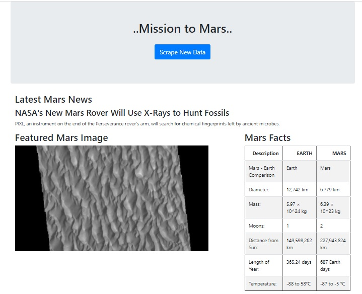
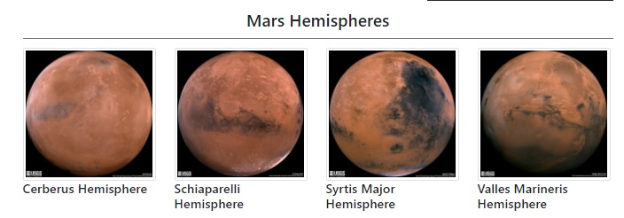

# web-scrapping-challenge
## Main Objective
The objective of this project is to build a web application that scrapes various websites for data related to the Mission to Mars and displays the information in a single HTML page.
## Process
- Create a Jupyter notebook called mission_to_mars_ipynb that includes the following tasks:
  - Scrape the Mars News Site and collect the latest News Title and Paragraph Text.
  - Visit the url for the Featured Space Image site, find the image url for the current Featured Mars Image and assign the url string to a variable.
  - Visit the Mars Facts webpage and scrape the table containing facts about the planet including Diameter, Mass, etc.
  - Visit the astrogeology site to obtain high resolution images for each of Mar's hemispheres.
- Use MongoDB with Flask templating to create a new HTML page that displays all of the information that was scraped from the URLs above.
## Screenshots
These are the screenshots of the final application:

